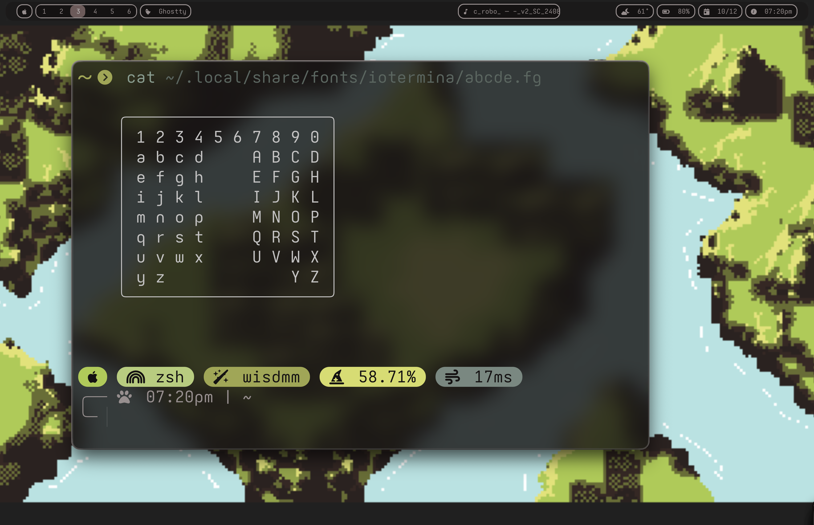
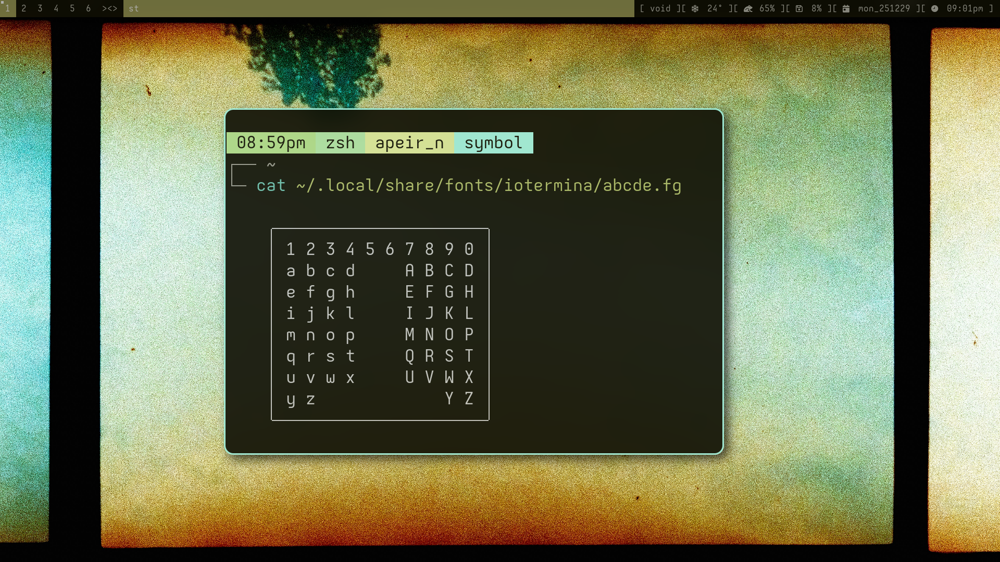
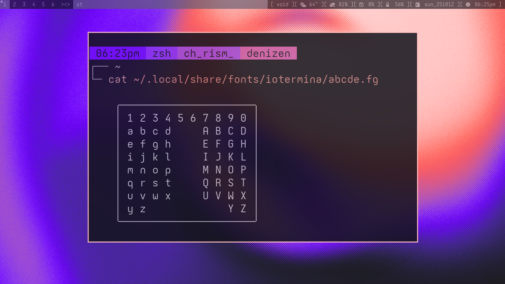

# Io Termina

> Io Termina on macOS

---

_Io_

> "The innermost and second-smallest of the four Galilean moons of Jupiter."

_Termina_

> "A parallel land to Hyrule that serves as the setting for Majora's Mask."

---

Fonts built from [Iosevka's](https://github.com/be5invis/Iosevka/blob/main/doc/custom-build.md) base using its build system, intended for use in a terminal. It was made to capture certain stylistic elements of fonts like JetBrains Mono and Terminus, but I attempted to fix some of the things I didn't like about those fonts, while working within the limited but super fun customization framework that Iosevka provides.

_Io Termina_ features mostly rounded, bug-eyed characters, while _Io Termina Mind_ has a subtly hardened corner on the relevant characters (i.e. bdqpnm, etc.) for a slightly less heady feel.

These fonts resemble the aforementioned fonts moreso than they do the classic Iosevka fonts. The elements I like about them are:
- the perfectly shaped center-dotted `0` from JetBrains
- the squircle-y but not too boxy design of rounded characters
- hooked `i` and `j`
- sort of wide spacing
- simple, stylistically consistent characters

Some unique features are:
- ambigram characters having symmetrical counterparts
    - like `m - w` and `b - d` being truly symmetrical
- `m` and `w` have short middle lines in _Io Termina Mind_ and _Mindless_

---

## Examples

> Io Termina Mind on Linux

The Mind variant is more fluttery and elvish like Zelda. The glyphs have longer tails in the italics typeface.

> Io Termina Mindless on Linux

The Mindless variant is the same as the original, but with shortened middle lines on `m`s and `w`s.
I prefer using this one on lower resolution screens.

---

### Customizing

If you want to use one of these Io Termina fonts as a base for further customization, you can do that by:
1. copying the contents of the `private-build-plans.toml` file in the desired font's subdirectory of this repo
2. go to the [Iosevka web customizer](https://typeof.net/Iosevka/customizer)
3. click `Import Configuration`
4. paste the contents of the `private-build-plans.toml` into it
    - you may need to omit the configuration under the `[buildPlans.IoTermina.metricOverride]` table, and add it back in after the web customizer generates your new config
    - I keep that metric override table at the bottom of the files
5. use the web interface to make your changes

After you configure it with the web UI, the new configuration will be generated at the bottom of the page, and you can copy the contents and put it in your own `private-build-plans.toml` config file. Then compile the new font with the `npm` command given below the newly generated configuration on the web UI page.

>[!note]
>There are several other things you will need to do to compile the fonts, but that is all outlined in [Iosevka's custom building documentation.](https://github.com/be5invis/Iosevka/blob/main/doc/custom-build.md) It's not too difficult, though it can be a bit CPU intensive. (literally the only time I've ever heard my m4 mac's fan come on was while compiling these fonts lol)

---

### License

This font is a personal modification of the [Iosevka typeface](https://github.com/be5invis/Iosevka) by Belleve Invis, published under the SIL Open Font License 1.1 (see LICENSE.md)

Modified by B. R. Shellito, 2025
